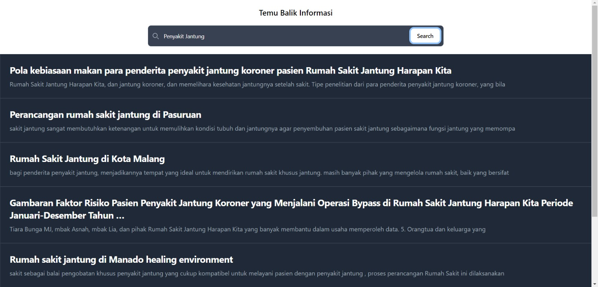

# Tugas Akhir Temu Balik Informasi

Aplikasi pencarian karya tulis ilmiah

## Run Locally

Clone this project

```bash
  git clone https://github.com/syahrulakbar/temu-balik-informasi
```

## Frontend

```bash
  npm i
```

```bash
  npm run dev
```

## Backend

```bash
  click run python file in up right editor or click f5
```

## Tech Stack

- React
- Vite
- Tailwind
- Javascript
- Python
- Scholarly

## Preview


